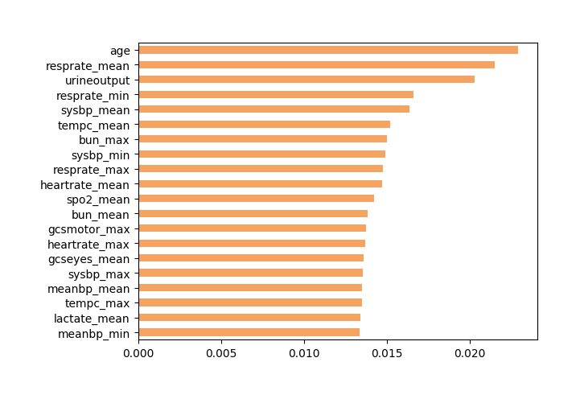
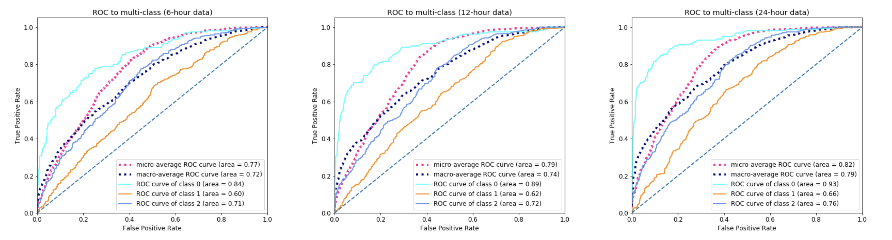
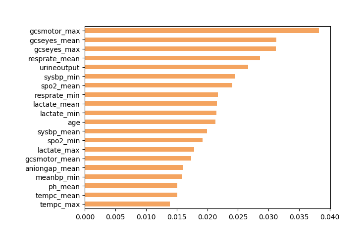

# Project Title : Mortality and Death Time Prediction Models using MIMIC-III


## Overview
This code repository presents a set of reproducible code for the final project of CSE6250. 
The aim of the project is to predict in-hospital mortality in the early stage of ICU stay (6-hour since ICU admission). If a patient is predicted dead, the model would further provide an estimate of death hours since ICU admission. Please refer to the paper for further explanation on the data source, methodology, model architecture and results. The directory structure of this repository is shown below.
```
├── Code
│   ├── Hive
│   │   ├── load_data.hql
│   │   ├── mp_cohort.hql
│   │   ├── mp_data.hql
│   │   ├── mp_data_6hr.hql
│   │   ├── mp_lab.hql
│   │   ├── mp_uo.hql
│   │   ├── mp_vital.hql
│   │   └── output_data.hql
│   ├── Python
│   │   ├── img
│   │   │   ├── figure1.png
│   │   │   ├── figure2.png
│   │   │   ├── figure3.png
│   │   │   ├── figure4.png
│   │   │   ├── figure5.png
│   │   │   ├── figure6.png
│   │   │   ├── figure7.png
│   │   │   └── figure_combine.png
│   │   ├── notebook
│   │   │   ├── EDA.ipynb
│   │   │   ├── POC_LSTM.ipynb
│   │   │   ├── POC_Regressor.ipynb
│   │   │   ├── Phase1_model.ipynb
│   │   │   ├── Phase2_model.ipynb
│   │   │   ├── env.template
│   │   │   ├── regressor_pipeline.py
│   │   │   └── utils.py
│   │   └── requirement.txt
│   └── SQL
│       ├── mp_bg.sql
│       ├── mp_cohort.sql
│       ├── mp_data.sql
│       ├── mp_data_6hr.sql
│       ├── mp_gcs.sql
│       ├── mp_hourly_cohort.sql
│       ├── mp_lab.sql
│       ├── mp_uo.sql
│       └── mp_vital.sql
├── README.md
└── paper.pdf
```

The project consists of 2 stages:

*Stage 1. Feature Engineering using Apache Hive*

*Stage 2. Machine Learning using Python*

* Stage 1 is implemented in Apache Hive 2.1.0 on Microsoft Azure remote cluster (see Environment Setup below). The relevant HQL scripts can be found in the directory `Code/Hive`. Some of the data preparation have also been made using SQL on a local Postgres database. Relevant SQL queries can be found the directory `Code/SQL`.
* Stage 2 is implemented in Python 3.6 on a local cluster (see Environment Setup below). The relevant Python notebooks can be found in the directory `Code/Python`.
* Presentation slides and paper can be found in the root directory.


## Environment Setup
**Stage 1. Feature Engineering using Apache Hive on Microsoft Azure**

Stage 1 has been deployed using Apache Hive 2.1.0 on Microsoft Azure HDInsight 3.6 ([Reference](https://docs.microsoft.com/en-us/azure/hdinsight/hdinsight-component-versioning)). The remote cluster consists of 2 head nodes and 1 worker node. Each node has the following specification ([Reference](https://azure.microsoft.com/en-us/pricing/details/cloud-services/)). 

| Component                     |  Spec   |
| :-----------------------------|:--------|
| Instance                      | D3 v2   |
| Core                          | 4       |
| RAM                           | 14 GB   |
| Storage                       | 200 GB  |


**Stage 2. Machine Learning using Python on Local Machine**

Stage 2 has been deployed on a local machine with the following specification. Python 3.6 and relevant packages have been used (see `Code/Python/requirement.txt`). 

| Component                     |  Spec   |
| :-----------------------------|:--------|
| Core                          | 4       |
| RAM                           | 16 GB   |
| GPU                           | 4 GB     |
| Storage                       | 500 GB  |


## Stage 1. Feature Engineering using Apache Hive

In Stage 1, we have extracted features for the first 6 hours, 12 hours or 24 hours since ICU admission for each ICU stay from MIMIC-III database. Specifically, we have selected the following dataset from MIMIC-III as input data, created intermediate tables and extracted useful features as shown in the table below. Data output in Stage 1 is then used as feature input for Stage 2 model prediction. 

| Input data from MIMIC-III   | Intermediate tables         | Output data from Stage 1    |
|:----------------------------|:----------------------------|:----------------------------|
|ICUSTAYS.csv                 | mp_cohort                   | mp_data_6hr.csv             |
|ADMISSIONS.csv               | mp_hourly_cohort            | mp_data_12hr.csv            |
|PATIENTS.csv                 | mp_gcs                      | mp_data_24hr.csv            |
|CHARTEVENTS.csv              | mp_bg, mp_bg_art            |                             |
|LABEVENTS.csv                | mp_lab                      |                             | 
|OUTPUTEVENTS.csv             | mp_uo                       |                             |
|                             | mp_vital                    |                             |
|                             | mp_data                     |                             |

In the proof-of-concept stage, we have done data preprocessing and feature engineering on a local Postgres MIMIC-III database (see this [Official Repo](https://github.com/MIT-LCP/mimic-code/tree/master/buildmimic/postgres) for setting up a local Postgres MIMIC-III database). The set of SQL scripts shown in the table below should produce all tables needed in this project. Note that reference has been made to the SQL queries provided in this [Repo](https://github.com/alistairewj/mortality-prediction/tree/master/queries) when constructing relevant features.

We then reproduced the code in Hive on Microsoft Azure. The decompressed dataset is around 40 GB. First, we loaded the csv files to the remote cluster on Microsoft Azure. Then, we ran the following HQL scripts to create tables. Note that `mp_hourly_cohort`, `mp_gcs` and `mp_bg` were generated in SQL and directly loaded to Hive due to time constraint, since these tables require sequence generation and complex non-equality left join conditions which are not supported by Hive and too tedious to be implemented in MapReduce. 

| HQL scripts           | SQL scripts       | Description                 |
|:----------------------|:----------------------|:----------------------------|
| load_data.hql     | --                    | Load tables from csv files  |
| mp_cohort.hql         | mp_cohort.sql         | Create table for patient cohort|
| --          | mp_hourly_cohort.sql  | Generate sequence of ICU hours per patient|
| --              | mp_gcs.sql        | Extract patients' Glasgow Coma Scale|
| --          | mp_bg.sql           | Extract patients' blood gas and chemistry values|
| mp_lab.hql          | mp_lab.sql        | Extract patients' lab results|  
| mp_uo.hql             | mp_uo.sql             | Extract patients' urine output|
| mp_vital.hql        | mp_vital.sql          | Extract patients' vital signs, eg. heart rate|
| mp_data.hql           | mp_data.sql         | Combine all tables created above to get all features at every ICU hour for each patient |
| mp_data_6hr.hql       | mp_data_6hr.sql     | Aggregate features extracted from mp_data table during the first 6 hours of ICU stay (similarly for 12-hour and 24-hour)|
| output_data.hql       | --                    |Output final tables to csv files|


## Stage 2. Machine Learning using Python

Stage 2 consists two phases of model training. Before we trained our models, we have done some exploratory data analysis to understand the study population. Please refer to the notebook `EDA.ipynb` for relevant summary statistics and data visualization of the study population.

In Phase 1, a binary classifier has been trained using features extracted in Stage 1 to predict in-hospital mortality. We have built a custom machine learning pipeline to select features, transform data, impute missing values and train a random forest classifier using grid search on 5-fold CV. We have also tested the trained model on a separate test set (20% of the entire dataset), evaluated the model result using metrics such as accuracy, precision, recall, F1 score, AUC, and plotted the ROC curve. Please refer to the notebook `Phase1_model.ipynb` for details of model construction, and the paper for further discussion on model comparison using 6-hour, 12-hour and 24-hour ICU data.

In Phase 2, a multiclass classifier has been trained to predict the death hours since ICU admission for those predicted dead patients in Phase 1. We have defined 3 classes for death time in hours since ICU admission. 

* Class 0 : death time < 1 day
* Class 1 : 1 day <= death time < 1 week
* Class 2 : death time >= 1 week 

Similar to Phase 1, we have built a custom machine learning pipeline to select features, transform data, impute missing values and train a random forest classifier using grid search on 5-fold CV. We have tested the trained model on a separate test set (20% of the entire dataset), and plotted the micro-average ROC curve, macro-average ROC curve and ROC curves for each class.  Please refer to the notebook `Phase2_model.ipynb` for details of model construction, and the paper for further discussion on model comparison using 6-hour, 12-hour and 24-hour ICU data.

We have also included additional notebooks which demonstrates some of our ideas in the proof-of-concept stage. For example, we have studied the feasibility of using LSTM to handle time series data, or using regressor instead of multiclass classifier to predict death time. Please refer to the relevant notebooks.

| Notebook                |  Description   |
| :-----------------------|:---------------|
| EDA.ipynb.              | Exploratory data analysis on the study population |
| Phase1_model.ipynb      | Random forest classifier to predict in-hospital mortality in Phase 1|
| Phase2_model.ipynb      | Random Forest Multiclass Classifier to predict death hours since ICU admission in Phase 2|
| POC_Regressor.ipynb     | Random Forest Regressor to predict death hours since ICU admission in Phase 2 (POC)|
| POC_LSTM.ipynb          | LSTM to predict in-hospital mortality in Phase 1 (POC)|


## Experimental Results
Some major results of the model performance are shown in the figures below. Please refer to the paper for discussion and conclusion. 

### Phase 1 Results
Figure 1: ROC curves


Figure 2: Feature Importance 


### Phase 2 Results
Figure 1: ROC curves


Figure 4: Feature Importance 


